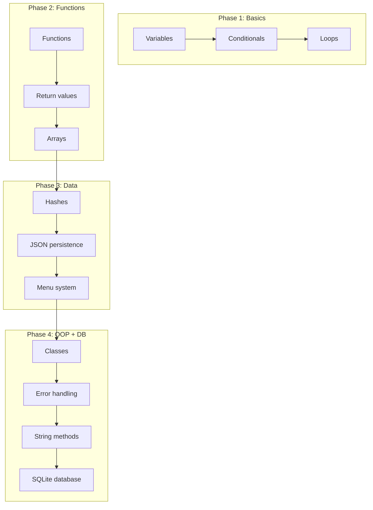
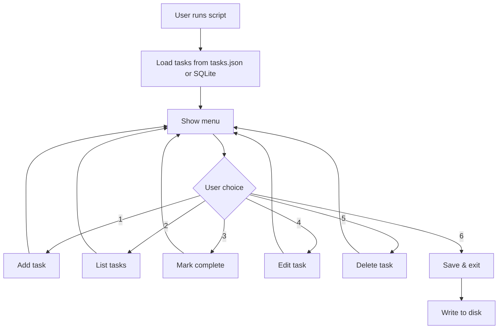

# BUILD_LOG.md

How this repo got here, and how to rebuild it from nothing.

## Part 1: what actually happened

This started as one file. On July 14, 2026, the first commit ("add ruby
practice files") added `conversionPoundsAndKilos.rb`, a heavily-commented
pounds-to-kilograms converter, plus a `rails/setup_rails.sh` script that
got pulled back out nineteen minutes later in the next commit ("remove
rails folder briefly"). Rails never came back. The repo stayed Ruby-only.

The next day, the numbered lesson series began, and it followed the same
pattern sixteen times in a row: create a branch named after the lesson
(`01-greet`, `02-conditional`, ...), commit one small script to it, open a
pull request, merge it into `main`. GitHub still has all sixteen of those
merge commits (PRs #1 through #16). Each lesson took somewhere between ten
minutes and half an hour, judging by the commit timestamps.

The lessons build on each other in a straight line:

- **01–06** are language basics with no state: `puts`/`gets`, an
  `if/else`, a `.times` loop, an `.each` over an array, a method, then a
  method that returns a value instead of just printing one.
- **07–12** turn that into a task list. Tasks start as plain strings in an
  array (07), become hashes with a `:done` flag (08), get a method to
  toggle that flag by searching for a task by name (09), get saved to
  `tasks.json` (10), get an interactive menu loop plus loading on startup
  (11), and finally get edit and delete (12) — full CRUD on a JSON file.
- A README landed after lesson 12, once there was an actual app worth
  explaining to someone else.
- **13–16** are the "do it properly" pass: the hash-based tasks get
  rebuilt as a `Task` class with `attr_accessor` and instance methods
  (13), bad input (letters instead of numbers, out-of-range indexes) gets
  caught with `rescue ArgumentError` instead of crashing the program (14),
  task names get `.strip`ped and empty names get rejected (15), and the
  whole thing gets rebuilt again on top of SQLite instead of a JSON file,
  with real `INSERT`/`UPDATE`/`DELETE` SQL (16).

Two weeks later, on August 1, two follow-up commits landed. One was a bug
fix: `16_database.rb` opened the SQLite file but never ran `CREATE TABLE`,
so the very first query against a fresh `tasks.db` crashed with
`SQLite3::SQLException: no such table: tasks`. The fix added a
`CREATE TABLE IF NOT EXISTS` before the menu loop. The other commit added
`tasks.json` and `tasks.db` to `.gitignore`. Both were runtime output
being generated by the save/load exercises, and both had already picked
up real personal notes from actually using the task manager. They're
excluded now; anyone rebuilding this repo will generate fresh, empty ones
the first time they run lesson 10 or later.

Later that same week, a single large commit ("add beginner-friendly
comments to all 16 Ruby exercise files") went back through every existing
script and added an inline comment to nearly every line, explaining the
Ruby syntax and the reasoning behind it. No logic changed. A few days
after that, a separate pass removed em dashes from the comments and
markdown files, and CI showed up: a GitHub Actions workflow that runs
`ruby -c` over every `.rb` file on push and PR, and a second workflow that
scans commits and files for AI-attribution strings and fails the build if
it finds any. That second workflow got tightened twice more, once to also
check the git author/committer fields (not just commit messages), and
once to stop flagging its own source file and normal GitHub merge
commits. A `docs/DESIGN.md` with a couple of Mermaid diagrams of the
lesson progression rounded things out.

That's the whole history: 24 tracked files, no framework, no tests beyond
a syntax check, built lesson-by-lesson over about four weeks.

## Part 2: rebuild it from an empty directory

The script below reproduces the repo's current state exactly: every file,
byte for byte, verified with `diff -r` against the real working tree
before this doc was written. Save it as `rebuild.sh` and run
`bash rebuild.sh` from wherever you want the project to live. It needs
nothing but `bash` and `git`. No GitHub account, no network access, no
one sitting at the keyboard filling in prompts.

A few honest simplifications, spelled out rather than hidden:

- The real history used sixteen short-lived branches and sixteen GitHub
  pull requests, one per lesson. Reproducing that here would mean
  scripting against GitHub's API with a token, which isn't "zero manual
  input" for someone who hasn't set that up. This script commits straight
  to `main` instead. The end state is identical; only the PR ceremony is
  gone.
- The comment pass, the em-dash cleanup, and the `16_database.rb` bug fix
  all happened as separate commits after the fact, on top of earlier,
  rougher versions of the same files. Retyping three drafts of sixteen
  files to replay that would triple the length of this script for no
  benefit, since only the end state matters if you're rebuilding. Each
  file below is written once, in its final, corrected, commented form.
- `rails/setup_rails.sh` was added and removed within the first twenty
  minutes of this repo's life and never shipped in anything that exists
  today. It's not reproduced here.

Everything else, every file path, every line of every script, every
commit message, is real and taken directly from this repo's tracked
files and git log.

````bash
#!/usr/bin/env bash
set -euo pipefail

mkdir -p ruby-learning-exercises && cd ruby-learning-exercises
git init -q
git checkout -q -b main
mkdir -p .github/workflows docs

# Standalone weight-converter exercise (predates the numbered lessons)
cat > "conversionPoundsAndKilos.rb" << 'RBEOF_00'
# ============================================================
# WEIGHT CONVERTER, fully explicit with every parenthesis shown
# and every line commented for a before-novice reader
# ============================================================
# HOW TO READ THESE COMMENTS:
# Lines starting with # are comments, Ruby ignores them completely.
# They are notes left by humans, for humans.
# The actual code is everything that does NOT start with #.
# ============================================================


# ============================================================
# METHOD 1: lbs_to_kg
# Purpose: take a weight number in pounds, return it in kilograms
# ============================================================

def lbs_to_kg(weight)                  # "def" means "define a method". The method is named lbs_to_kg.
                                        # (weight) is the INPUT, a number this method receives when called.
                                        # Think of (weight) as a labeled box the caller drops a number into.

  result = (weight / 2.205)             # Divide whatever number is in the "weight" box by 2.205.
                                        # 2.205 is the conversion factor: 1 kg = 2.205 lbs.
                                        # The parentheses make explicit that division happens first.
                                        # Store the answer in a new box called "result".

  return result.round(2)                # .round(2) trims the decimal to 2 places. e.g. 70.00453 becomes 70.0.
                                        # "return" sends this value back OUT of the method to whoever called it.
                                        # Explicit return: we are being deliberate about what leaves this method.

end                                     # "end" closes the method definition that "def" opened above.


# ============================================================
# METHOD 2: kg_to_lbs
# Purpose: take a weight number in kilograms, return it in pounds
# ============================================================

def kg_to_lbs(weight)                  # Same structure as above, define a method, receive one input called weight.

  result = (weight * 2.205)             # Multiply by 2.205 this time (going the other direction: kg → lbs).
                                        # Parentheses again make the order of operations visually explicit.

  return result.round(2)                # Trim to 2 decimal places and send the value back to the caller.

end                                     # Close the method.


# ============================================================
# METHOD 3: print_lbs_to_kg
# Purpose: call lbs_to_kg and print a human-readable sentence
# ============================================================

def print_lbs_to_kg(weight)            # Define a method. Receives one input: a number in pounds.

  converted = lbs_to_kg(weight)        # Call the lbs_to_kg method we defined above, pass (weight) into it.
                                        # lbs_to_kg does the math and RETURNS a number.
                                        # We catch that returned number and store it in a box called "converted".

  puts("Your weight is #{converted} kg") # "puts" prints a line of text to the terminal, then moves to a new line.
                                        # The parentheses after puts make explicit that we are passing it an argument.
                                        # #{converted} is called STRING INTERPOLATION, Ruby reaches into the
                                        # "converted" box, grabs the number, and drops it into the middle of the string.
                                        # The final string might look like: "Your weight is 70.31 kg"

end                                     # Close the method.


# ============================================================
# METHOD 4: print_kg_to_lbs
# Purpose: call kg_to_lbs and print a human-readable sentence
# ============================================================

def print_kg_to_lbs(weight)            # Define a method. Receives one input: a number in kilograms.

  converted = kg_to_lbs(weight)        # Call kg_to_lbs, pass in the weight. Store the returned number in "converted".

  puts("Your weight is #{converted} lbs") # Print the result sentence. Same interpolation as above, just says "lbs".

end                                     # Close the method.


# ============================================================
# METHOD 5: get_user_input
# Purpose: ask the user questions, collect their answers, return them
# ============================================================

def get_user_input()                   # Define a method. Empty parentheses () = no inputs needed from a caller.
                                        # This method gets its data FROM THE USER TYPING, not from another method.

  puts("What is your weight?")         # Print a question to the terminal so the user knows what to type.

  raw_input = gets()                   # "gets" PAUSES the program and waits for the user to type something
                                        # and press Enter. Whatever they typed (including the Enter keystroke)
                                        # is stored in a box called "raw_input". The () makes explicit we call gets.

  trimmed = raw_input.chomp()          # .chomp() removes the invisible newline character that Enter adds to the end.
                                        # Without this, "150\n" stays "150\n", the \n causes problems later.
                                        # After chomp: "150\n" becomes "150".

  weight = trimmed.to_f()              # .to_f() converts the string "150" into the number 150.0
                                        # "to_f" means "to float", a float is a number that can have decimals.
                                        # We need a number (not text) because we're going to do math with it.
                                        # Store the number in a box called "weight".

  if(weight <= 0)                      # "if" checks a condition. The parentheses make the condition visually explicit.
                                        # weight <= 0 means "is the weight less than or equal to zero?"
                                        # This catches negative numbers and zero, which aren't valid weights.

    puts("Please enter a weight greater than zero.") # Tell the user what went wrong.

    return get_user_input()            # "return" here exits this method immediately and calls ITSELF again.
                                        # This is called RECURSION, the method restarts from the top.
                                        # The user gets asked the question again until they give a valid number.

  end                                  # Close the "if" block.

  puts("Is that in (L)bs or (K)g?")   # Ask the user which unit their number is in.

  raw_unit = gets()                    # Pause and wait for the user to type "L", "K", or anything else.

  unit = raw_unit.chomp().downcase()   # .chomp() removes the Enter keystroke again.
                                        # .downcase() converts whatever they typed to lowercase.
                                        # So "L", "l", "LBS" all become "l". Prevents case-mismatch bugs.
                                        # Store the cleaned result in a box called "unit".

  return weight, unit                  # Return TWO values at once back to whoever called this method.
                                        # Ruby allows this, the two values travel together as a pair.
                                        # The caller can unpack them into two separate boxes.

end                                    # Close the method.


# ============================================================
# METHOD 6: print_weight_conversion
# Purpose: decide WHICH conversion to run based on the unit the user gave
# ============================================================

def print_weight_conversion(weight, unit) # Define a method. Receives TWO inputs: the number and the unit letter.

  case(unit)                           # "case" is like a multi-way if statement. It looks at the value in "unit".
                                        # Parentheses make explicit what we are examining.

  when("l")                            # If unit is exactly the string "l" (lowercase L)...
    print_lbs_to_kg(weight)            # ...call the print method for pounds-to-kg, pass in the weight.

  when("k")                            # If unit is exactly the string "k"...
    print_kg_to_lbs(weight)            # ...call the print method for kg-to-pounds, pass in the weight.

  else                                 # If unit is anything other than "l" or "k" (e.g. "x", "z", "hello")...
    puts("I don't support that unit of measurement") # ...tell the user we don't know what they meant.

  end                                  # Close the "case" block.

end                                    # Close the method.


# ============================================================
# METHOD 7: main
# Purpose: the conductor, calls the other methods in the right order,
#          keeps the program running until the user decides to quit
# ============================================================

def main()                             # Define the main method. No inputs needed, it runs the whole show.

  loop do                              # "loop do" starts an infinite loop. It will repeat forever...
                                        # ...until it hits a "break" instruction somewhere inside it.

    weight, unit = get_user_input()    # Call get_user_input(). It returns two values.
                                        # We unpack them into two boxes: "weight" gets the number, "unit" gets the letter.
                                        # This is called PARALLEL ASSIGNMENT, two boxes filled in one line.

    print_weight_conversion(weight, unit) # Call the conversion decider, hand it both boxes.
                                        # It will figure out which direction to convert and print the result.

    puts("Convert another? (y/n)")     # Ask the user if they want to go again.

    answer = gets().chomp().downcase() # Wait for input, remove the newline, lowercase it. Store in "answer".

    if(answer != "y")                  # "!=" means "not equal to". If the user did NOT type "y"...
      break                            # ..."break" exits the loop immediately. The program ends.
    end                                # Close the if block. If they DID type "y", we do nothing here,
                                        # the loop just cycles back to the top and starts over.

  end                                  # Close the "loop do" block.

end                                    # Close the main method.


# ============================================================
# ENTRY POINT, this is the only line that actually RUNS on its own.
# Everything above is just definitions sitting in memory, doing nothing.
# This single line is what kicks the whole program off.
# ============================================================

main()                                 # Call the main method. No inputs needed.
                                        # This is where execution begins. main() calls get_user_input(),
                                        # which calls gets(), which calls nothing, it waits for the human.
                                        # The whole chain unwinds from this one line at the bottom.
RBEOF_00

git add conversionPoundsAndKilos.rb
git commit -q -m "add ruby practice files"

# Lesson: 01_greet.rb
cat > "01_greet.rb" << 'RBEOF_1'
# ============================================================
# FILE: 01_greet.rb
# PURPOSE: The very first Ruby exercise, ask a name, greet them.
# CONCEPTS: puts (print), gets (input), chomp, string interpolation
# ============================================================

puts "What is your name?"          # "puts" prints text to the terminal followed by a newline.
                                   # The text inside quotes is a "string", just a piece of text.

name = gets.chomp                 # "gets" pauses the program and waits for the user to type + press Enter.
                                   # ".chomp" removes the invisible newline character that Enter adds.
                                   # "name =" stores what the user typed into a variable called "name".
                                   # A variable is like a labeled box that holds a value.

puts "Hello, #{name}!"            # Prints a greeting. #{name} is "string interpolation", Ruby replaces
                                   # #{name} with whatever is stored in the "name" variable.
                                   # So if name is "Alice", it prints: Hello, Alice!
RBEOF_1

git add "01_greet.rb"
git commit -q -m "add greet program: greet user by name"

# Lesson: 02_conditional.rb
cat > "02_conditional.rb" << 'RBEOF_2'
# ============================================================
# FILE: 02_conditional.rb
# PURPOSE: Greet differently based on who the user is.
# CONCEPTS: if/else, string comparison (==), variables
# ============================================================

puts "What is your name?"          # Prints the question to the terminal so the user knows what to type.

name = gets.chomp                 # Waits for user input, strips the trailing newline, stores it in "name".

if name == "Landon"               # "if" starts a conditional check. "==" compares two values for equality.
                                  # This checks: is the name exactly the string "Landon"?
  puts "Hey, it's you!"           # This runs ONLY if name equals "Landon", a special greeting.

else                              # "else" catches every other case, if name is NOT "Landon".
  puts "Hello, #{name}!"          # Generic greeting using string interpolation with the user's name.

end                               # "end" closes the if/else block. Ruby needs this to know where the
                                  # conditional stops.
RBEOF_2

git add "02_conditional.rb"
git commit -q -m "add conditional program: check if name matches"

# Lesson: 03_loop.rb
cat > "03_loop.rb" << 'RBEOF_3'
# ============================================================
# FILE: 03_loop.rb
# PURPOSE: Repeat a greeting a fixed number of times.
# CONCEPTS: gets, chomp, .times loop, string interpolation
# ============================================================

puts "What is your name?"          # Asks the user for their name by printing to the terminal.

name = gets.chomp                 # Reads user input from the keyboard, removes the Enter newline,
                                  # and stores the result in a variable called "name".

3.times do                        # ".times" is a loop that runs the block of code between do/end
                                  # exactly 3 times. "3.times" means "do this 3 times".
  puts "Hello, #{name}!"          # Each time through the loop, prints a greeting with the user's name.
                                  # So if name is "Bob", it prints "Hello, Bob!" three times.
end                               # "end" closes the .times block. Everything between do and end repeats.

RBEOF_3

git add "03_loop.rb"
git commit -q -m "add loop program: greet user 3 times"

# Lesson: 04_list_loop.rb
cat > "04_list_loop.rb" << 'RBEOF_4'
# ============================================================
# FILE: 04_list_loop.rb
# PURPOSE: Loop through a list (array) and greet each item.
# CONCEPTS: arrays, .each iterator, string interpolation
# ============================================================

names = ["LandonTheFirst", "LandonTheSecond", "LandonTheThird"]
                                  # Creates an "array", an ordered list of strings.
                                  # Arrays use square brackets [] and separate items with commas.
                                  # Each item has a position: index 0, 1, 2, etc.

names.each do |name|              # ".each" loops through every item in the array.
                                  # "|name|" is a block variable, on each pass, it holds the current item.
                                  # First pass: name = "LandonTheFirst", second: "LandonTheSecond", etc.
  puts "Hello, #{name}!"          # Prints a greeting for the current name in the loop.
end                               # "end" closes the .each block. The loop is done when all items are visited.
RBEOF_4

git add "04_list_loop.rb"
git commit -q -m "add list loop program: greet each name in a list"

# Lesson: 05_function.rb
cat > "05_function.rb" << 'RBEOF_5'
# ============================================================
# FILE: 05_function.rb
# PURPOSE: Wrap greeting logic in a reusable function (method).
# CONCEPTS: def/end (method definition), parameters, calling methods
# ============================================================

def greet(name)                   # "def" starts a method definition. "greet" is the method's name.
                                  # "(name)" is a parameter, a placeholder for data the caller provides.
                                  # Think of it as an input slot that must be filled when calling greet.
  if name == "LandonTheFirst"     # Checks if the passed-in name equals "LandonTheFirst".
    puts "Hey, it's you!"         # Special greeting for that specific name.
  else                            # All other names get the generic greeting below.
    puts "Hello, #{name}!"        # Prints a personalized greeting using string interpolation.
  end                             # Closes the if/else block.
end                               # Closes the method definition. greet is now usable anywhere below.

greet("LandonTheFirst")           # Calls greet with "LandonTheFirst", triggers the special greeting.
greet("LandonTheSecond")          # Calls greet with "LandonTheSecond", triggers the generic greeting.
greet("LandonTheThird")           # Calls greet with "LandonTheThird", also gets the generic greeting.
RBEOF_5

git add "05_function.rb"
git commit -q -m "add function: reusable greet logic for multiple names"

# Lesson: 06_return.rb
cat > "06_return.rb" << 'RBEOF_6'
# ============================================================
# FILE: 06_return.rb
# PURPOSE: Return a value from a method instead of printing directly.
# CONCEPTS: method return values, implicit return, variables storing results
# ============================================================

def build_greeting(name)          # Defines a method named "build_greeting" that takes one input: "name".
  if name == "Landon"             # Checks if the name equals "Landon".
    "Hey, it's you!"              # This is the RETURN VALUE. In Ruby, the last expression in a method
                                  # is automatically returned, no "return" keyword needed.
                                  # This is called "implicit return".
  else                            # If name is anything other than "Landon"...
    "Hello, #{name}!"             # ...return this string instead. Both branches return a string.
  end                             # Closes the if/else.
end                               # Closes the method.

message = build_greeting("Landon")  # Calls build_greeting, gets back "Hey, it's you!",
                                    # and stores it in a variable called "message".
puts message                        # Prints the stored greeting to the terminal.

message2 = build_greeting("NotLandon")  # Calls it again with a different name.
                                        # Gets back "Hello, NotLandon!" and stores in message2.
puts message2                           # Prints the second greeting.
RBEOF_6

git add "06_return.rb"
git commit -q -m "add function with return value: build greeting message"

# Lesson: 07-add-list-tasks.rb
cat > "07-add-list-tasks.rb" << 'RBEOF_7'
# ============================================================
# FILE: 07-add-list-tasks.rb
# PURPOSE: A simple task list, add tasks and display them.
# CONCEPTS: arrays, push (<<), methods with multiple parameters, .each
# ============================================================

tasks = []                        # Creates an empty array called "tasks".
                                  # The [] means "nothing here yet", we'll fill it as we go.

def add_task(tasks, task_name)    # Defines a method that takes TWO inputs: the list and a task name.
                                  # "tasks" is the array to add to, "task_name" is the new task string.
  tasks << task_name              # "<<" is the push operator, it adds task_name to the END of the array.
                                  # This modifies the original array (it does NOT create a new one).
end                               # Closes the add_task method.

def list_tasks(tasks)             # Defines a method to display all tasks. Takes the array as input.
  tasks.each do |task|            # ".each" loops through every item in the tasks array.
                                  # On each pass, "|task|" holds the current task string.
    puts "- #{task}"              # Prints each task with a dash prefix for visual formatting.
  end                             # Closes the .each loop.
end                               # Closes the list_tasks method.

add_task(tasks, "Buy groceries")           # Calls add_task, adds "Buy groceries" to the tasks array.
add_task(tasks, "Finish portfolio project") # Adds a second task to the array.
add_task(tasks, "Call the bank")           # Adds a third task.

list_tasks(tasks)                 # Calls list_tasks, prints all three tasks to the terminal.
RBEOF_7

git add "07-add-list-tasks.rb"
git commit -q -m "add task manager: add and list tasks"

# Lesson: 08_structured_tasks.rb
cat > "08_structured_tasks.rb" << 'RBEOF_8'
# ============================================================
# FILE: 08_structured_tasks.rb
# PURPOSE: Tasks stored as hashes with name + completion status.
# CONCEPTS: hashes, symbols (:name, :done), ternary operator (? :)
# ============================================================

tasks = []                        # Creates an empty array to hold task hashes (not just strings anymore).

def add_task(tasks, name)         # Defines add_task, takes the array and a task name string.
  task = { name: name, done: false }
                                  # Creates a HASH, a collection of key-value pairs inside {}.
                                  # :name is a "symbol" (like a labeled tag) mapped to the task name.
                                  # :done starts as false (the task is not yet complete).
                                  # Symbols are lightweight, fast identifiers used as hash keys.
  tasks << task                   # Adds the hash to the end of the tasks array.
end                               # Closes the method.

def list_tasks(tasks)             # Defines list_tasks to display all tasks with their status.
  tasks.each do |task|            # Loops through every hash in the tasks array.
                                  # Each "task" variable is a hash like { name: "Buy groceries", done: false }.
    status = task[:done] ? "✓" : " "
                                  # Reads the :done value from the hash. "?" is the ternary operator:
                                  # condition ? value_if_true : value_if_false
                                  # If done is true → status = "✓", otherwise status = " " (empty).
    puts "[#{status}] #{task[:name]}"
                                  # Prints the task with its status checkbox.
                                  # Example output: [✓] Buy groceries  or  [ ] Call the bank
  end                             # Closes the .each loop.
end                               # Closes the list_tasks method.

add_task(tasks, "Buy groceries")           # Adds the first task hash to the array.
add_task(tasks, "Finish portfolio project") # Adds the second task hash.
add_task(tasks, "Call the bank")           # Adds the third task hash.

list_tasks(tasks)                 # Prints all tasks, none are marked done yet.
RBEOF_8

git add "08_structured_tasks.rb"
git commit -q -m "add structured tasks: hashes with name and done status"

# Lesson: 09_mark_complete.rb
cat > "09_mark_complete.rb" << 'RBEOF_9'
# ============================================================
# FILE: 09_mark_complete.rb
# PURPOSE: Mark a task as done by finding it by name.
# CONCEPTS: searching arrays, modifying hash values, .each with conditional
# ============================================================

tasks = []                        # Creates an empty array to store task hashes.

def add_task(tasks, name)         # Defines add_task to add a new task to the array.
  task = { name: name, done: false }
                                  # Creates a hash with two keys: :name (the task text) and :done (false).
  tasks << task                   # Pushes the hash onto the end of the tasks array.
end                               # Closes the method.

def list_tasks(tasks)             # Defines list_tasks to display all tasks with checkboxes.
  tasks.each do |task|            # Loops through each task hash in the array.
    status = task[:done] ? "✓" : " "
                                  # Ternary operator: if :done is true show "✓", otherwise show " ".
    puts "[#{status}] #{task[:name]}"
                                  # Prints formatted task like: [✓] Buy groceries
  end                             # Closes the loop.
end                               # Closes list_tasks.

def complete_task(tasks, name)    # Defines a NEW method, finds a task by name and marks it done.
  tasks.each do |task|            # Loops through every task hash in the array.
    if task[:name] == name        # Checks if this task's :name matches the name we're looking for.
      task[:done] = true          # If it matches, set :done to true, the task is now complete!
    end                           # Closes the if statement.
  end                             # Closes the loop. (If no match found, nothing happens.)
end                               # Closes complete_task.

add_task(tasks, "Buy groceries")           # Adds three tasks to the list.
add_task(tasks, "Finish portfolio project")
add_task(tasks, "Call the bank")

complete_task(tasks, "Buy groceries")      # Finds "Buy groceries" and marks it done.

list_tasks(tasks)                 # Prints all tasks, "Buy groceries" should now show [✓].
RBEOF_9

git add "09_mark_complete.rb"
git commit -q -m "add complete_task method: mark a task as done by name"

# Lesson: 10_save_tasks.rb
cat > "10_save_tasks.rb" << 'RBEOF_10'
# ============================================================
# FILE: 10_save_tasks.rb
# PURPOSE: Save tasks to a file so they persist between runs.
# CONCEPTS: require, JSON library, File.write, .to_json
# ============================================================

require "json"                    # "require" loads an external library. "json" lets Ruby read/write
                                  # JSON format, a common way to store structured data as text.
                                  # JSON looks like: {"name":"Buy groceries","done":false}

tasks = []                        # Creates an empty array to hold task hashes.

def add_task(tasks, name)         # Defines add_task, adds a new task hash to the array.
  task = { name: name, done: false }
                                  # Creates a hash with :name and :done keys.
  tasks << task                   # Appends the hash to the tasks array.
end                               # Closes add_task.

def list_tasks(tasks)             # Defines list_tasks to display all tasks.
  tasks.each do |task|            # Loops through each task hash in the array.
    status = task[:done] ? "✓" : " "
                                  # Shows "✓" if done, " " if not.
    puts "[#{status}] #{task[:name]}"
                                  # Prints each task with its checkbox.
  end                             # Closes the loop.
end                               # Closes list_tasks.

def complete_task(tasks, name)    # Defines complete_task, marks a task done by name.
  tasks.each do |task|            # Loops through every task.
    if task[:name] == name        # Checks if this task's name matches.
      task[:done] = true          # Sets :done to true if it matches.
    end                           # Closes the if.
  end                             # Closes the loop.
end                               # Closes complete_task.

def save_tasks(tasks)             # Defines a NEW method, saves the tasks array to a file.
  File.write("tasks.json", tasks.to_json)
                                  # tasks.to_json converts the array into a JSON text string.
                                  # File.write creates/overwrites "tasks.json" with that string.
                                  # After this, tasks are saved on disk and survive program restarts.
end                               # Closes save_tasks.

add_task(tasks, "Buy groceries")           # Adds three tasks.
add_task(tasks, "Finish portfolio project")
add_task(tasks, "Call the bank")

complete_task(tasks, "Buy groceries")      # Marks "Buy groceries" as done.

list_tasks(tasks)                 # Displays all tasks in the terminal.
save_tasks(tasks)                 # Saves everything to tasks.json on disk.
RBEOF_10

git add "10_save_tasks.rb"
git commit -q -m "add save_tasks: persist tasks to a JSON file"

# Lesson: 11_load_and_menu.rb
cat > "11_load_and_menu.rb" << 'RBEOF_11'
# ============================================================
# FILE: 11_load_and_menu.rb
# PURPOSE: Load saved tasks + interactive menu to manage them.
# CONCEPTS: File.exist?, File.read, JSON.parse, loop, case-style if/elsif
# ============================================================

require "json"                    # Loads the JSON library for reading/writing JSON data.

def add_task(tasks, name)         # Defines add_task, creates a task hash and appends it.
  task = { name: name, done: false }
                                  # Hash with :name (string) and :done (boolean, starts false).
  tasks << task                   # Pushes the hash onto the tasks array.
end                               # Closes add_task.

def list_tasks(tasks)             # Defines list_tasks with numbered output.
  tasks.each_with_index do |task, i|
                                  # ".each_with_index" is like .each but also gives you the position (index).
                                  # First pass: task = first hash, i = 0. Second: task = second hash, i = 1.
    status = task[:done] ? "✓" : " "
                                  # Shows "✓" if done, " " if not.
    puts "#{i + 1}. [#{status}] #{task[:name]}"
                                  # Prints numbered task: "1. [✓] Buy groceries"
                                  # i + 1 because humans count from 1, but arrays start at 0.
  end                             # Closes the loop.
end                               # Closes list_tasks.

def complete_task(tasks, index)   # Marks a task done by its INDEX (position number).
  tasks[index][:done] = true      # Accesses the task at position "index" and sets :done to true.
end                               # Closes complete_task.

def uncomplete_task(tasks, index) # Marks a task as NOT done by its index.
  tasks[index][:done] = false     # Sets :done back to false.
end                               # Closes uncomplete_task.

def save_tasks(tasks)             # Saves the tasks array to a JSON file on disk.
  File.write("tasks.json", JSON.pretty_generate(tasks))
                                  # JSON.pretty_generate converts the array to nicely formatted JSON
                                  # (with indentation). File.write writes it to "tasks.json".
end                               # Closes save_tasks.

def load_tasks                    # Defines load_tasks, reads tasks from disk when the program starts.
  if File.exist?("tasks.json")    # Checks if the file "tasks.json" exists on disk.
                                  # If the file doesn't exist yet, we skip to else and return an empty list.
    content = File.read("tasks.json")
                                  # Reads the entire file contents into a string variable.
    JSON.parse(content, symbolize_names: true)
                                  # Converts the JSON string back into a Ruby array of hashes.
                                  # symbolize_names: true makes keys symbols (:name) instead of strings ("name").
  else                            # If the file doesn't exist (first time running)...
    []                            # ...return an empty array, no saved tasks yet.
  end                             # Closes the if/else.
end                               # Closes load_tasks.

tasks = load_tasks               # Loads any previously saved tasks. Empty array if first run.

loop do                           # "loop do" starts an infinite loop, repeats until "break" is hit.
  puts "\n1. Add task"            # "\n" adds a blank line before the menu for readability.
  puts "2. List tasks"            # Displays menu option 2.
  puts "3. Mark task complete"    # Displays menu option 3.
  puts "4. Mark task incomplete"  # Displays menu option 4.
  puts "5. Quit"                  # Displays menu option 5.
  print "Choose an option: "      # "print" (not puts) keeps the cursor on the same line for input.
  choice = gets.chomp             # Reads the user's menu choice and stores it as a string.

  if choice == "1"                # User chose to add a task.
    print "Task name: "           # Asks for the task name.
    name = gets.chomp             # Reads the task name from input.
    add_task(tasks, name)         # Adds the task to the array.
    save_tasks(tasks)             # Saves to disk immediately so it's not lost.
  elsif choice == "2"             # User chose to list tasks.
    list_tasks(tasks)             # Displays all tasks.
  elsif choice == "3"             # User chose to mark a task complete.
    list_tasks(tasks)             # Shows tasks so they can see the numbers.
    print "Which task number to complete? "
                                  # Asks which task to mark done.
    index = gets.chomp.to_i - 1   # Reads the number, converts to integer with .to_i,
                                  # subtracts 1 to convert from human (1-based) to array (0-based) index.
    complete_task(tasks, index)   # Marks that task as done.
    save_tasks(tasks)             # Saves to disk.
  elsif choice == "4"             # User chose to mark a task incomplete.
    list_tasks(tasks)             # Shows the tasks.
    print "Which task number to mark incomplete? "
                                  # Asks which task to un-complete.
    index = gets.chomp.to_i - 1   # Converts input to 0-based index.
    uncomplete_task(tasks, index) # Sets :done back to false.
    save_tasks(tasks)             # Saves to disk.
  elsif choice == "5"             # User chose to quit.
    break                         # "break" exits the loop, the program ends.
  else                            # User typed something invalid (not 1-5).
    puts "Invalid option, try again."
                                  # Tells them to try a valid number.
  end                             # Closes the if/elsif/else chain.
end                               # Closes the loop do.

RBEOF_11

git add "11_load_and_menu.rb"
git commit -q -m "add load_tasks and interactive menu: add/list/complete/uncomplete/quit"

# Lesson: 12_edit_and_delete.rb
cat > "12_edit_and_delete.rb" << 'RBEOF_12'
# ============================================================
# FILE: 12_edit_and_delete.rb
# PURPOSE: Full task manager, add, list, complete, edit, delete.
# CONCEPTS: all previous concepts + editing hashes, deleting from arrays
# ============================================================

require "json"                    # Loads the JSON library for file I/O.

def add_task(tasks, name)         # Defines add_task, creates and appends a task hash.
  task = { name: name, done: false }
                                  # Hash with :name (the text) and :done (starts false).
  tasks << task                   # Appends to the tasks array.
end                               # Closes add_task.

def list_tasks(tasks)             # Defines list_tasks, displays all tasks numbered.
  tasks.each_with_index do |task, i|
                                  # Loops with both the task hash and its index (position).
    status = task[:done] ? "✓" : " "
                                  # Ternary: "✓" if done, " " if not.
    puts "#{i + 1}. [#{status}] #{task[:name]}"
                                  # Prints: "1. [ ] Buy groceries" (human-friendly numbering).
  end                             # Closes the loop.
end                               # Closes list_tasks.

def complete_task(tasks, index)   # Marks a task as done by index.
  tasks[index][:done] = true      # Sets :done to true on the task at that position.
end                               # Closes complete_task.

def uncomplete_task(tasks, index) # Marks a task as NOT done by index.
  tasks[index][:done] = false     # Sets :done back to false.
end                               # Closes uncomplete_task.

def edit_task(tasks, index, new_name)
                                  # Defines edit_task, changes a task's name.
  tasks[index][:name] = new_name  # Accesses the task at "index" and replaces :name with new_name.
end                               # Closes edit_task.

def delete_task(tasks, index)     # Defines delete_task, removes a task from the array.
  tasks.delete_at(index)          # ".delete_at" removes the item at the given position.
                                  # The array shrinks, everything after shifts down by one.
end                               # Closes delete_task.

def save_tasks(tasks)             # Saves tasks to disk as JSON.
  File.write("tasks.json", JSON.pretty_generate(tasks))
                                  # Converts to formatted JSON and writes to tasks.json.
end                               # Closes save_tasks.

def load_tasks                    # Loads tasks from disk when the program starts.
  if File.exist?("tasks.json")    # Checks if the saved file exists.
    content = File.read("tasks.json")
                                  # Reads the file contents as a string.
    JSON.parse(content, symbolize_names: true)
                                  # Converts JSON string back to Ruby array of hashes.
  else                            # No file found (first run).
    []                            # Returns an empty array.
  end                             # Closes the if/else.
end                               # Closes load_tasks.

tasks = load_tasks               # Loads saved tasks (or starts empty).

loop do                           # Infinite loop for the interactive menu.
  puts "\n1. Add task"            # Menu option 1.
  puts "2. List tasks"            # Menu option 2.
  puts "3. Mark task complete"    # Menu option 3.
  puts "4. Mark task incomplete"  # Menu option 4.
  puts "5. Edit task"             # Menu option 5 (NEW in this file).
  puts "6. Delete task"           # Menu option 6 (NEW in this file).
  puts "7. Quit"                  # Menu option 7.
  print "Choose an option: "      # Prompts for input without a newline.
  choice = gets.chomp             # Reads the user's choice.

  if choice == "1"                # Add a new task.
    print "Task name: "           # Asks for the task name.
    name = gets.chomp             # Reads input.
    add_task(tasks, name)         # Adds to the array.
    save_tasks(tasks)             # Saves to disk.
  elsif choice == "2"             # List all tasks.
    list_tasks(tasks)             # Displays them.
  elsif choice == "3"             # Mark a task complete.
    list_tasks(tasks)             # Shows tasks with numbers.
    print "Which task number to complete? "
                                  # Asks which one.
    index = gets.chomp.to_i - 1   # Converts to 0-based index.
    complete_task(tasks, index)   # Marks it done.
    save_tasks(tasks)             # Saves to disk.
  elsif choice == "4"             # Mark a task incomplete.
    list_tasks(tasks)             # Shows tasks.
    print "Which task number to mark incomplete? "
                                  # Asks which one.
    index = gets.chomp.to_i - 1   # Converts to 0-based index.
    uncomplete_task(tasks, index) # Marks it not done.
    save_tasks(tasks)             # Saves to disk.
  elsif choice == "5"             # Edit a task (NEW).
    list_tasks(tasks)             # Shows tasks so user can pick by number.
    print "Which task number to edit? "
                                  # Asks which task to rename.
    index = gets.chomp.to_i - 1   # Converts to 0-based index.
    print "New name: "            # Asks for the new task name.
    new_name = gets.chomp         # Reads the new name.
    edit_task(tasks, index, new_name)
                                  # Replaces the old name with the new one.
    save_tasks(tasks)             # Saves to disk.
  elsif choice == "6"             # Delete a task (NEW).
    list_tasks(tasks)             # Shows tasks so user can pick by number.
    print "Which task number to delete? "
                                  # Asks which task to remove.
    index = gets.chomp.to_i - 1   # Converts to 0-based index.
    delete_task(tasks, index)     # Removes the task from the array.
    save_tasks(tasks)             # Saves to disk.
  elsif choice == "7"             # Quit.
    break                         # Exits the loop, program ends.
  else                            # Invalid input.
    puts "Invalid option, try again."
                                  # Tells user to enter a valid number.
  end                             # Closes the if/elsif/else chain.
end                               # Closes the loop.
RBEOF_12

git add "12_edit_and_delete.rb"
git commit -q -m "add edit_task and delete_task methods and menu options"

# Project README
cat > "README.md" << 'MDEOF_readme'
# Task Manager         

A command-line task manager built while learning fundamentals.

## Features
- Add tasks
- List tasks with completion status
- Mark tasks complete/incomplete
- Edit task names
- Delete tasks
- Persists to `tasks.json` so tasks survive between runs

## Run it
ruby 12_edit_and_delete.rb

## What this project demonstrates
Variables, conditionals, loops, functions, hashes, list mutation,
file I/O (JSON), and an interactive menu-driven program loop.
MDEOF_readme

git add README.md
git commit -q -m "add README explaining task manager project"

# Lesson: 13_classes.rb
cat > "13_classes.rb" << 'RBEOF_13'
# ============================================================
# FILE: 13_classes.rb
# PURPOSE: Organize tasks using a class, a blueprint for task objects.
# CONCEPTS: class, attr_accessor, initialize, instance methods, @instance variables
# ============================================================

require "json"                    # Loads the JSON library for saving/loading data.

class Task                        # "class" defines a blueprint. A Task class means every task object
                                  # has the same structure: a name, a done status, and the same methods.
  attr_accessor :name, :done      # "attr_accessor" auto-creates getter and setter methods for :name and :done.
                                  # This means you can read AND write task.name and task.done from outside.
                                  # Without this, @name and @done would be locked inside the class.

  def initialize(name, done = false)
                                  # "initialize" is a special method called automatically when you create
                                  # a new Task with Task.new("something"). It sets up the object's initial state.
                                  # "done = false" means done is optional, if not provided, it defaults to false.
    @name = name                  # "@name" is an instance variable, it belongs to THIS specific task object.
                                  # It stores the task's name. The @ prefix makes it an instance variable.
    @done = done                  # "@done" stores whether the task is complete. Starts as false by default.
  end                             # Closes initialize.

  def complete                    # Defines an instance method, called on a specific task object.
    @done = true                  # Sets this task's :done to true.
  end                             # Closes complete.

  def uncomplete                  # Defines another instance method.
    @done = false                 # Sets this task's :done back to false.
  end                             # Closes uncomplete.

  def to_h                        # Defines to_h, converts this task object back into a hash.
                                  # We need this because JSON can't save Ruby objects directly,
                                  # but it CAN save hashes.
    { name: @name, done: @done }  # Returns a hash with the task's data. This is called "serialization".
  end                             # Closes to_h.

  def display(index)              # Defines display, prints this task with its number.
    status = @done ? "✓" : " "   # Shows "✓" if done, " " if not.
    puts "#{index + 1}. [#{status}] #{@name}"
                                  # Prints formatted task: "1. [ ] Buy groceries"
  end                             # Closes display.
end                               # Closes the Task class definition.

def save_tasks(tasks)             # Saves an array of Task objects to disk.
  data = tasks.map { |task| task.to_h }
                                  # ".map" transforms each Task object into a hash using to_h.
                                  # The result is an array of hashes, which JSON can handle.
  File.write("tasks.json", JSON.pretty_generate(data))
                                  # Converts to formatted JSON and writes to the file.
end                               # Closes save_tasks.

def load_tasks                    # Loads tasks from disk, returning Task objects.
  if File.exist?("tasks.json")    # Checks if the saved file exists.
    content = File.read("tasks.json")
                                  # Reads the file as a string.
    data = JSON.parse(content, symbolize_names: true)
                                  # Parses JSON into an array of hashes.
    data.map { |item| Task.new(item[:name], item[:done]) }
                                  # ".map" converts each hash back into a Task object.
                                  # Task.new creates a new Task with the saved name and done status.
  else                            # No file found.
    []                            # Returns empty array.
  end                             # Closes the if/else.
end                               # Closes load_tasks.

tasks = load_tasks               # Loads saved tasks from disk.

loop do                           # Infinite loop for the interactive menu.
  puts "\n1. Add task"            # Menu option 1.
  puts "2. List tasks"            # Menu option 2.
  puts "3. Mark task complete"    # Menu option 3.
  puts "4. Mark task incomplete"  # Menu option 4.
  puts "5. Edit task"             # Menu option 5.
  puts "6. Delete task"           # Menu option 6.
  puts "7. Quit"                  # Menu option 7.
  print "Choose an option: "      # Prompts for input.
  choice = gets.chomp             # Reads user choice.

  if choice == "1"                # Add a new task.
    print "Task name: "           # Asks for the task name.
    name = gets.chomp             # Reads input.
    tasks << Task.new(name)       # Creates a NEW Task object and appends it to the array.
                                  # Task.new(name) calls initialize with done = false (the default).
    save_tasks(tasks)             # Saves to disk.
  elsif choice == "2"             # List tasks.
    tasks.each_with_index { |task, i| task.display(i) }
                                  # Loops and calls each task's display method with its index.
                                  # This uses a "block" form, concise one-line syntax with {}.
  elsif choice == "3"             # Mark complete.
    tasks.each_with_index { |task, i| task.display(i) }
                                  # Shows all tasks with numbers.
    print "Which task number to complete? "
                                  # Asks which one.
    index = gets.chomp.to_i - 1   # Converts to 0-based index.
    tasks[index].complete         # Calls the complete method on that specific task object.
    save_tasks(tasks)             # Saves to disk.
  elsif choice == "4"             # Mark incomplete.
    tasks.each_with_index { |task, i| task.display(i) }
                                  # Shows tasks.
    print "Which task number to mark incomplete? "
                                  # Asks which one.
    index = gets.chomp.to_i - 1   # Converts to 0-based index.
    tasks[index].uncomplete       # Calls uncomplete on that task.
    save_tasks(tasks)             # Saves to disk.
  elsif choice == "5"             # Edit a task.
    tasks.each_with_index { |task, i| task.display(i) }
                                  # Shows tasks.
    print "Which task number to edit? "
                                  # Asks which task.
    index = gets.chomp.to_i - 1   # Converts to 0-based index.
    print "New name: "            # Asks for the new name.
    new_name = gets.chomp         # Reads the new name.
    tasks[index].name = new_name  # Uses attr_accessor setter to change the task's name directly.
    save_tasks(tasks)             # Saves to disk.
  elsif choice == "6"             # Delete a task.
    tasks.each_with_index { |task, i| task.display(i) }
                                  # Shows tasks.
    print "Which task number to delete? "
                                  # Asks which one.
    index = gets.chomp.to_i - 1   # Converts to 0-based index.
    tasks.delete_at(index)        # Removes the task from the array.
    save_tasks(tasks)             # Saves to disk.
  elsif choice == "7"             # Quit.
    break                         # Exits the loop.
  else                            # Invalid input.
    puts "Invalid option, try again."
                                  # Tells user to try again.
  end                             # Closes the if/elsif/else.
end                               # Closes the loop.
RBEOF_13

git add 13_classes.rb
git commit -q -m "rebuild full task manager menu using Task class"

# Lesson: 14_error_handling.rb
cat > "14_error_handling.rb" << 'RBEOF_14'
# ============================================================
# FILE: 14_error_handling.rb
# PURPOSE: Handle bad user input gracefully without crashing.
# CONCEPTS: rescue, ArgumentError, Integer(), nil checks, unless
# ============================================================

require "json"                    # Loads the JSON library.

class Task                        # Defines the Task class (same blueprint as file 13).
  attr_accessor :name, :done      # Creates getter/setter methods for :name and :done.

  def initialize(name, done = false)
                                  # Called when Task.new is used. Sets @name and @done.
    @name = name                  # Stores the task name as an instance variable.
    @done = done                  # Stores done status (defaults to false).
  end                             # Closes initialize.

  def complete                    # Marks this task as done.
    @done = true                  # Sets @done to true.
  end                             # Closes complete.

  def uncomplete                  # Marks this task as not done.
    @done = false                 # Sets @done to false.
  end                             # Closes uncomplete.

  def to_h                        # Converts this task to a hash for JSON saving.
    { name: @name, done: @done }  # Returns a hash with the task's data.
  end                             # Closes to_h.

  def display(index)              # Prints this task with its number.
    status = @done ? "✓" : " "   # Shows "✓" if done, " " if not.
    puts "#{index + 1}. [#{status}] #{@name}"
                                  # Prints formatted output.
  end                             # Closes display.
end                               # Closes Task class.

def save_tasks(tasks)             # Saves tasks to disk as formatted JSON.
  data = tasks.map { |task| task.to_h }
                                  # Converts each Task object to a hash.
  File.write("tasks.json", JSON.pretty_generate(data))
                                  # Writes the JSON string to tasks.json.
end                               # Closes save_tasks.

def load_tasks                    # Loads tasks from disk.
  if File.exist?("tasks.json")    # Checks if the file exists.
    content = File.read("tasks.json")
                                  # Reads file contents.
    data = JSON.parse(content, symbolize_names: true)
                                  # Parses JSON into an array of hashes.
    data.map { |item| Task.new(item[:name], item[:done]) }
                                  # Converts each hash back to a Task object.
  else                            # File doesn't exist.
    []                            # Returns empty array.
  end                             # Closes if/else.
end                               # Closes load_tasks.

def get_valid_index(tasks, prompt)
                                  # Defines a helper method for safe input handling.
                                  # This prevents crashes from bad user input (letters, negative numbers, etc.).
  print prompt                    # Displays the prompt text (e.g., "Which task number to complete? ").
  input = gets.chomp              # Reads user input and removes trailing newline.
  index = Integer(input) - 1      # "Integer()" tries to convert the string to a number.
                                  # If input is "abc", it raises an ArgumentError, caught by rescue below.
                                  # Subtract 1 to convert from human numbering (1-based) to array index (0-based).
  if index < 0 || index >= tasks.length
                                  # Checks if the index is out of bounds, negative or too large.
    puts "That task number doesn't exist."
                                  # Tells the user the number is invalid.
    return nil                    # Returns nil (Ruby's "nothing" value) to signal failure.
  end                             # Closes the bounds check.
  index                           # If all checks pass, returns the valid 0-based index.
rescue ArgumentError              # "rescue" catches errors. ArgumentError happens when Integer() fails.
                                  # If the user typed "hello" instead of a number, we land here.
  puts "That's not a valid number."
                                  # Friendly error message instead of a crash.
  nil                             # Returns nil to signal the caller that input was bad.
end                               # Closes get_valid_index.

tasks = load_tasks               # Loads saved tasks from disk.

loop do                           # Infinite loop for the interactive menu.
  puts "\n1. Add task"            # Menu option 1.
  puts "2. List tasks"            # Menu option 2.
  puts "3. Mark task complete"    # Menu option 3.
  puts "4. Mark task incomplete"  # Menu option 4.
  puts "5. Edit task"             # Menu option 5.
  puts "6. Delete task"           # Menu option 6.
  puts "7. Quit"                  # Menu option 7.
  print "Choose an option: "      # Prompts for input.
  choice = gets.chomp             # Reads user choice.

  if choice == "1"                # Add a task.
    print "Task name: "           # Asks for the name.
    name = gets.chomp             # Reads input.
    tasks << Task.new(name)       # Creates a new Task and appends it.
    save_tasks(tasks)             # Saves to disk.
  elsif choice == "2"             # List tasks.
    tasks.each_with_index { |task, i| task.display(i) }
                                  # Displays all tasks.
  elsif choice == "3"             # Mark complete.
    tasks.each_with_index { |task, i| task.display(i) }
                                  # Shows tasks with numbers.
    index = get_valid_index(tasks, "Which task number to complete? ")
                                  # Uses the safe input method, returns nil if input was bad.
    unless index.nil?             # "unless nil?" means "if it's NOT nil", input was valid.
      tasks[index].complete       # Marks the task as done.
      save_tasks(tasks)           # Saves to disk.
    end                           # Closes the unless block.
  elsif choice == "4"             # Mark incomplete.
    tasks.each_with_index { |task, i| task.display(i) }
                                  # Shows tasks.
    index = get_valid_index(tasks, "Which task number to mark incomplete? ")
                                  # Safe input handling.
    unless index.nil?             # Only proceeds if input was valid.
      tasks[index].uncomplete     # Marks as not done.
      save_tasks(tasks)           # Saves to disk.
    end                           # Closes unless.
  elsif choice == "5"             # Edit task.
    tasks.each_with_index { |task, i| task.display(i) }
                                  # Shows tasks.
    index = get_valid_index(tasks, "Which task number to edit? ")
                                  # Safe input handling.
    unless index.nil?             # Only if valid.
      print "New name: "          # Asks for new name.
      new_name = gets.chomp       # Reads new name.
      tasks[index].name = new_name # Sets the task's name.
      save_tasks(tasks)           # Saves to disk.
    end                           # Closes unless.
  elsif choice == "6"             # Delete task.
    tasks.each_with_index { |task, i| task.display(i) }
                                  # Shows tasks.
    index = get_valid_index(tasks, "Which task number to delete? ")
                                  # Safe input handling.
    unless index.nil?             # Only if valid.
      tasks.delete_at(index)      # Removes the task.
      save_tasks(tasks)           # Saves to disk.
    end                           # Closes unless.
  elsif choice == "7"             # Quit.
    break                         # Exits the loop.
  else                            # Invalid menu option.
    puts "Invalid option, try again."
                                  # Tells user to try again.
  end                             # Closes if/elsif/else.
end                               # Closes loop.
RBEOF_14

git add 14_error_handling.rb
git commit -q -m "add error handling for invalid task number input"

# Lesson: 15_string_methods.rb
cat > "15_string_methods.rb" << 'RBEOF_15'
# ============================================================
# FILE: 15_string_methods.rb
# PURPOSE: Add input validation using string methods (.strip, empty?).
# CONCEPTS: .strip, .empty?, preventing empty task names
# ============================================================


require "json"                    # Loads the JSON library for saving/loading data.

class Task                        # Defines the Task class blueprint.
  attr_accessor :name, :done      # Getter/setter methods for :name and :done.

  def initialize(name, done = false)
                                  # Called on Task.new. Sets initial values.
    @name = name                  # Stores the task name.
    @done = done                  # Stores done status (defaults to false).
  end                             # Closes initialize.

  def complete                    # Instance method to mark done.
    @done = true                  # Sets @done to true.
  end                             # Closes complete.

  def uncomplete                  # Instance method to mark not done.
    @done = false                 # Sets @done to false.
  end                             # Closes uncomplete.

  def to_h                        # Converts this task to a hash for JSON.
    { name: @name, done: @done }  # Returns hash with task data.
  end                             # Closes to_h.

  def display(index)              # Prints this task with its number.
    status = @done ? "✓" : " "   # Shows status symbol.
    puts "#{index + 1}. [#{status}] #{@name}"
                                  # Prints formatted task.
  end                             # Closes display.
end                               # Closes Task class.

def save_tasks(tasks)             # Saves tasks to disk as JSON.
  data = tasks.map { |task| task.to_h }
                                  # Converts Task objects to hashes.
  File.write("tasks.json", JSON.pretty_generate(data))
                                  # Writes formatted JSON to tasks.json.
end                               # Closes save_tasks.

def load_tasks                    # Loads tasks from disk.
  if File.exist?("tasks.json")    # Checks if saved file exists.
    content = File.read("tasks.json")
                                  # Reads file contents.
    data = JSON.parse(content, symbolize_names: true)
                                  # Parses JSON to array of hashes.
    data.map { |item| Task.new(item[:name], item[:done]) }
                                  # Converts hashes to Task objects.
  else                            # No file found.
    []                            # Returns empty array.
  end                             # Closes if/else.
end                               # Closes load_tasks.

def get_valid_index(tasks, prompt)
                                  # Safe input handler, prevents crashes from bad input.
  print prompt                    # Displays the question.
  input = gets.chomp              # Reads user input.
  index = Integer(input) - 1      # Converts to integer, adjusts to 0-based index.
                                  # Integer() raises ArgumentError if input isn't a number.
  if index < 0 || index >= tasks.length
                                  # Checks if index is out of range.
    puts "That task number doesn't exist."
                                  # Friendly error message.
    return nil                    # Returns nil to signal failure.
  end                             # Closes bounds check.
  index                           # Returns valid index.
rescue ArgumentError              # Catches non-numeric input.
  puts "That's not a valid number."
                                  # Friendly error instead of crash.
  nil                             # Returns nil.
end                               # Closes get_valid_index.

tasks = load_tasks               # Loads saved tasks from disk.

loop do                           # Infinite loop for the menu.
  puts "\n1. Add task"            # Menu option 1.
  puts "2. List tasks"            # Menu option 2.
  puts "3. Mark task complete"    # Menu option 3.
  puts "4. Mark task incomplete"  # Menu option 4.
  puts "5. Edit task"             # Menu option 5.
  puts "6. Delete task"           # Menu option 6.
  puts "7. Quit"                  # Menu option 7.
  print "Choose an option: "      # Prompts for input.
  choice = gets.chomp             # Reads user choice.

  if choice == "1"                # Add a task.
    print "Task name: "           # Asks for the name.
    name = gets.chomp.strip       # Reads input AND calls .strip to remove leading/trailing whitespace.
                                  # .strip removes spaces, tabs, and newlines from both ends of the string.
                                  # So "  Buy milk  " becomes "Buy milk".
    if name == ""                 # Checks if the name is empty after stripping whitespace.
                                  # An empty string means the user just pressed Enter or typed spaces.
      puts "Task name can't be empty."
                                  # Tells the user they must provide a name.
    else                          # Name is valid (not empty).
      tasks << Task.new(name)     # Creates a new Task and appends it.
      save_tasks(tasks)           # Saves to disk.
    end                           # Closes the empty-check.
  elsif choice == "2"             # List tasks.
    tasks.each_with_index { |task, i| task.display(i) }
                                  # Displays all tasks.
  elsif choice == "3"             # Mark complete.
    tasks.each_with_index { |task, i| task.display(i) }
                                  # Shows tasks with numbers.
    index = get_valid_index(tasks, "Which task number to complete? ")
                                  # Safe input handling.
    unless index.nil?             # Only if input was valid.
      tasks[index].complete       # Marks as done.
      save_tasks(tasks)           # Saves to disk.
    end                           # Closes unless.
  elsif choice == "4"             # Mark incomplete.
    tasks.each_with_index { |task, i| task.display(i) }
                                  # Shows tasks.
    index = get_valid_index(tasks, "Which task number to mark incomplete? ")
                                  # Safe input.
    unless index.nil?             # Only if valid.
      tasks[index].uncomplete     # Marks as not done.
      save_tasks(tasks)           # Saves to disk.
    end                           # Closes unless.
  elsif choice == "5"             # Edit task.
    tasks.each_with_index { |task, i| task.display(i) }
                                  # Shows tasks.
    index = get_valid_index(tasks, "Which task number to edit? ")
                                  # Safe input.
    unless index.nil?             # Only if valid.
      print "New name: "          # Asks for new name.
      new_name = gets.chomp.strip # Reads input and strips whitespace.
                                  # .strip ensures "  " (just spaces) becomes "".
      if new_name == ""           # Checks if the new name is empty.
        puts "Task name can't be empty."
                                  # Rejects empty names.
      else                        # Name is valid.
        tasks[index].name = new_name # Updates the task's name.
        save_tasks(tasks)         # Saves to disk.
      end                         # Closes the empty-check.
    end                           # Closes unless.
  elsif choice == "6"             # Delete task.
    tasks.each_with_index { |task, i| task.display(i) }
                                  # Shows tasks.
    index = get_valid_index(tasks, "Which task number to delete? ")
                                  # Safe input.
    unless index.nil?             # Only if valid.
      tasks.delete_at(index)      # Removes the task from the array.
      save_tasks(tasks)           # Saves to disk.
    end                           # Closes unless.
  elsif choice == "7"             # Quit.
    break                         # Exits the loop.
  else                            # Invalid menu option.
    puts "Invalid option, try again."
                                  # Tells user to try again.
  end                             # Closes if/elsif/else.
end                               # Closes loop.
RBEOF_15

git add 15_string_methods.rb
git commit -q -m "add input validation: strip whitespace and reject empty task names"

# Lesson: 16_database.rb (written here with the CREATE TABLE fix already included)
cat > "16_database.rb" << 'RBEOF_16'
# ============================================================
# FILE: 16_database.rb
# PURPOSE: Store tasks in a real database (SQLite) instead of JSON files.
# CONCEPTS: SQLite3, SQL queries, database tables, primary keys
# ============================================================

require "sqlite3"                 # Loads the sqlite3 gem, a library that lets Ruby talk to SQLite databases.
                                  # SQLite is a lightweight database engine that stores data in a single file.

db = SQLite3::Database.new("tasks.db")
                                  # Creates (or opens) a database file called "tasks.db".
                                  # If it doesn't exist yet, SQLite creates it automatically.
                                  # "db" is now a connection to that database file.

db.results_as_hash = true         # Makes query results come back as hashes (with column names as keys)
                                  # instead of plain arrays. So row["name"] works instead of row[1].

db.execute("CREATE TABLE IF NOT EXISTS tasks (
  id INTEGER PRIMARY KEY AUTOINCREMENT,
  name TEXT NOT NULL,
  done BOOLEAN NOT NULL DEFAULT 0
)")                                # WHY: SQLite.new only opens/creates the .db FILE, it does not create
                                  # any tables inside it. Without this, the very first query below
                                  # (INSERT/SELECT/UPDATE/DELETE) would fail with
                                  # "SQLite3::SQLException: no such table: tasks" on a fresh database.
                                  # "IF NOT EXISTS" makes this safe to run every time the script starts,
                                  # it creates the table once and does nothing on later runs.
                                  # id: auto-incrementing primary key (SQLite's row identifier).
                                  # name: the task text, required (NOT NULL).
                                  # done: 0/1 completion flag, defaults to 0 (not done) for new rows.

def add_task(db, name)            # Defines add_task, inserts a row into the tasks table.
  db.execute("INSERT INTO tasks (name, done) VALUES (?, ?)", [name, 0])
                                  # "db.execute" runs a SQL command on the database.
                                  # INSERT INTO tasks adds a new row to the "tasks" table.
                                  # The (?) are "placeholders", they get filled by the values in [name, 0].
                                  # Using placeholders prevents SQL injection attacks (a security thing).
                                  # The name goes in the "name" column, 0 (false) goes in "done".
end                               # Closes add_task.

def list_tasks(db)                # Defines list_tasks, reads all rows from the database.
  rows = db.execute("SELECT * FROM tasks")
                                  # "SELECT * FROM tasks" fetches ALL columns from ALL rows in the tasks table.
                                  # Returns an array of hashes (because of results_as_hash = true).
  rows.each do |row|              # Loops through each row (hash) returned by the query.
    status = row["done"] == 1 ? "✓" : " "
                                  # In SQLite, booleans are stored as 0 (false) or 1 (true).
                                  # So we check if "done" equals 1 to show "✓", otherwise " ".
    puts "#{row["id"]}. [#{status}] #{row["name"]}"
                                  # Prints: "1. [✓] Buy groceries"
                                  # row["id"] is the database's unique ID for that task (auto-assigned).
  end                             # Closes the loop.
end                               # Closes list_tasks.

def complete_task(db, id)         # Defines complete_task, marks a task done by its database ID.
  db.execute("UPDATE tasks SET done = 1 WHERE id = ?", [id])
                                  # "UPDATE tasks SET done = 1" changes the "done" column to 1 (true).
                                  # "WHERE id = ?" ensures we only update the row with that specific ID.
                                  # Without WHERE, ALL tasks would be marked done!
end                               # Closes complete_task.

def uncomplete_task(db, id)       # Defines uncomplete_task, marks a task as not done.
  db.execute("UPDATE tasks SET done = 0 WHERE id = ?", [id])
                                  # Sets "done" to 0 (false) for the task with that ID.
end                               # Closes uncomplete_task.

def edit_task(db, id, new_name)   # Defines edit_task, changes a task's name in the database.
  db.execute("UPDATE tasks SET name = ? WHERE id = ?", [new_name, id])
                                  # Updates the "name" column to new_name for the task with that ID.
end                               # Closes edit_task.

def delete_task(db, id)           # Defines delete_task, removes a task from the database permanently.
  db.execute("DELETE FROM tasks WHERE id = ?", [id])
                                  # "DELETE FROM tasks" removes the row with the matching ID.
                                  # This is permanent, there's no undo in the database!
end                               # Closes delete_task.

loop do                           # Infinite loop for the interactive menu.
  puts "\n1. Add task"            # Menu option 1.
  puts "2. List tasks"            # Menu option 2.
  puts "3. Mark task complete"    # Menu option 3.
  puts "4. Mark task incomplete"  # Menu option 4.
  puts "5. Edit task"             # Menu option 5.
  puts "6. Delete task"           # Menu option 6.
  puts "7. Quit"                  # Menu option 7.
  print "Choose an option: "      # Prompts for input.
  choice = gets.chomp             # Reads user choice.

  if choice == "1"                # Add a task.
    print "Task name: "           # Asks for the name.
    name = gets.chomp.strip       # Reads input and removes whitespace with .strip.
    if name == ""                 # Checks if name is empty.
      puts "Task name can't be empty."
                                  # Rejects empty names.
    else                          # Name is valid.
      add_task(db, name)          # Inserts into the database.
    end                           # Closes empty-check.
  elsif choice == "2"             # List tasks.
    list_tasks(db)                # Fetches and displays all rows from the database.
  elsif choice == "3"             # Mark complete.
    list_tasks(db)                # Shows tasks so user can see the IDs.
    print "Which task id to complete? "
                                  # Asks for the database ID (not array index, IDs are permanent).
    id = gets.chomp.to_i          # Reads the ID as an integer.
    complete_task(db, id)         # Updates the database.
  elsif choice == "4"             # Mark incomplete.
    list_tasks(db)                # Shows tasks.
    print "Which task id to mark incomplete? "
                                  # Asks for the ID.
    id = gets.chomp.to_i          # Reads the ID.
    uncomplete_task(db, id)       # Updates the database.
  elsif choice == "5"             # Edit task.
    list_tasks(db)                # Shows tasks.
    print "Which task id to edit? "
                                  # Asks for the ID.
    id = gets.chomp.to_i          # Reads the ID.
    print "New name: "            # Asks for the new name.
    new_name = gets.chomp.strip   # Reads and strips whitespace.
    edit_task(db, id, new_name) unless new_name == ""
                                  # Updates the name, but ONLY if it's not empty.
                                  # "unless" means "if not", the opposite of if.
  elsif choice == "6"             # Delete task.
    list_tasks(db)                # Shows tasks.
    print "Which task id to delete? "
                                  # Asks for the ID.
    id = gets.chomp.to_i          # Reads the ID.
    delete_task(db, id)           # Removes from database permanently.
  elsif choice == "7"             # Quit.
    break                         # Exits the loop.
  else                            # Invalid input.
    puts "Invalid option, try again."
                                  # Tells user to try again.
  end                             # Closes if/elsif/else.
end                               # Closes loop.
RBEOF_16

git add 16_database.rb
git commit -q -m "rebuild task manager using SQLite database instead of JSON file"

# Ignore runtime output from the save/load and database lessons
cat > ".gitignore" << 'GIEOF'
# Runtime output from the exercise scripts — not code, and previously
# contained real personal notes. Never commit either of these.
tasks.json
tasks.db
GIEOF

git add .gitignore
git commit -q -m "chore: gitignore tasks.json/tasks.db (runtime output, not code)"

# CI: syntax-check every .rb file on push/PR
cat > ".github/workflows/ci.yml" << 'YMLEOF_ci'
name: CI

on:
  push:
  pull_request:

jobs:
  syntax-check:
    runs-on: ubuntu-latest
    steps:
      - uses: actions/checkout@v4

      - name: Set up Ruby
        uses: ruby/setup-ruby@v1
        with:
          ruby-version: "3.2"

      - name: Syntax check all Ruby files
        run: |
          find . -name "*.rb" -print0 | xargs -0 -n1 ruby -c
YMLEOF_ci

git add .github/workflows/ci.yml
git commit -q -m "add GitHub Actions CI (syntax check)"

# CI: block AI attribution in commit metadata and file contents (final, refined version)
cat > ".github/workflows/ai-attribution-check.yml" << 'YMLEOF_ai'
name: Block AI Attribution

on:
  pull_request:
    branches: [main, master, dev, staging]
  push:
    branches: [main, master, dev, staging]

jobs:
  check-no-ai-attribution:
    runs-on: ubuntu-latest
    name: Block AI Author / Co-Author
    steps:
      - name: Checkout code
        uses: actions/checkout@v4
        with:
          fetch-depth: 0

      - name: Scan commits for AI attribution
        run: |
          echo "Scanning commits for AI attribution..."

          if [ "${{ github.event_name }}" = "pull_request" ]; then
            BASE=${{ github.event.pull_request.base.sha }}
            HEAD=${{ github.event.pull_request.head.sha }}
            COMMITS=$(git log --format="%H" "$BASE".."$HEAD" 2>/dev/null || git log --format="%H" "$HEAD" -1)
          else
            COMMITS=$(git log --format="%H" HEAD -5)
          fi

          BLOCKED_NAMES="claude opencode chatgpt gpt gemini mimo llama copilot deepseek mistral perplexity cursor windsurf aider cline continue tabnine codeium cody phind bard ollama vllm lmstudio localai jan openchat anthropic"
          BLOCKED_EMAILS="noreply@anthropic noreply@opencode noreply@openai noreply@google noreply@microsoft noreply@meta noreply@deepseek noreply@mistral noreply@sourcegraph"

          FOUND=0
          for SHA in $COMMITS; do
            MSG=$(git log -1 --format="%B" "$SHA")
            AUTHOR_NAME=$(git log -1 --format="%an" "$SHA")
            AUTHOR_EMAIL=$(git log -1 --format="%ae" "$SHA")
            COMMITTER_NAME=$(git log -1 --format="%cn" "$SHA")
            COMMITTER_EMAIL=$(git log -1 --format="%ce" "$SHA")

            HIT=""

            for keyword in $BLOCKED_NAMES $BLOCKED_EMAILS; do
              if echo "$AUTHOR_NAME $AUTHOR_EMAIL $COMMITTER_NAME $COMMITTER_EMAIL" | grep -qi "$keyword"; then
                HIT="$keyword"
              fi
            done

            for keyword in $BLOCKED_NAMES; do
              if echo "$MSG" | grep -qiE "(Co-Authored-By|Generated with|Generated-by).*$keyword"; then
                HIT="$keyword"
              fi
            done
            for email in $BLOCKED_EMAILS; do
              if echo "$MSG" | grep -qi "$email"; then
                HIT="$email"
              fi
            done

            if [ -n "$HIT" ]; then
              echo ""
              echo "❌ AI attribution found in commit $SHA (matched '$HIT'):"
              echo "   Author: $AUTHOR_NAME <$AUTHOR_EMAIL>"
              echo "   Committer: $COMMITTER_NAME <$COMMITTER_EMAIL>"
              echo "   Message preview: $(echo "$MSG" | head -3)"
              FOUND=1
            fi
          done

          if [ "$FOUND" -eq 1 ]; then
            echo ""
            echo "❌ Commits contain AI author/committer or attribution."
            echo "   Remove all AI references before merging."
            exit 1
          fi

          echo "✓ No AI attribution found"

      - name: Scan files for embedded attribution
        run: |
          echo "Scanning files for embedded AI attribution..."

          BLOCKED_TOOLS="Claude|opencode|ChatGPT|GPT|Gemini|MiMo|Llama|Copilot|DeepSeek|Mistral|Perplexity|Cursor|Windsurf|Aider|Cline|Continue|Tabnine|Codeium|Cody|Phind|Bard"
          PATTERN="(Co-Authored-By:.*(${BLOCKED_TOOLS})|Generated with.*(${BLOCKED_TOOLS})|Generated-by:.*(${BLOCKED_TOOLS})|noreply@anthropic|noreply@opencode|noreply@openai|noreply@google|noreply@microsoft|noreply@meta|noreply@deepseek|noreply@mistral|noreply@sourcegraph)"

          MATCHES=$(grep -r -i -l -E "$PATTERN" \
            --exclude-dir=.git \
            --exclude-dir=node_modules \
            --exclude-dir=.venv --exclude-dir=venv \
            --exclude-dir=.build --exclude-dir=.swiftpm \
            --exclude-dir=dist --exclude-dir=build \
            --exclude-dir=vendor --exclude-dir=Pods \
            --exclude-dir=DerivedData \
            --exclude-dir=.gradle --exclude-dir=.idea \
            --exclude-dir=.ruff_cache --exclude-dir=__pycache__ \
            --exclude-dir=pr-backup \
            --exclude="ai-attribution-check.yml" \
            . 2>/dev/null || true)

          if [ -n "$MATCHES" ]; then
            echo ""
            echo "❌ Files containing AI attribution references:"
            echo "$MATCHES"
            exit 1
          fi

          echo "✓ No embedded AI attribution found in files"
YMLEOF_ai

git add .github/workflows/ai-attribution-check.yml
git commit -q -m "add workflow to block AI attribution in commits"

# Design doc: mermaid diagrams of the learning path
cat > "docs/DESIGN.md" << 'MDEOF_design'
# landonkea-ruby-learning-exercises - Design & Workflow

## High-Level Overview

```mermaid
graph TB
    subgraph "Progressive Learning Path"
        A[01_greet.rb] --> B[02_conditional.rb]
        B --> C[03_loop.rb]
        C --> D[04_list_loop.rb]
        D --> E[05_function.rb]
        E --> F[06_return.rb]
        F --> G[07-add-list-tasks.rb]
        G --> H[08_structured_tasks.rb]
        H --> I[09_mark_complete.rb]
        I --> J[10_save_tasks.rb]
        J --> K[11_load_and_menu.rb]
        K --> L[12_edit_and_delete.rb]
        L --> M[13_classes.rb]
        M --> N[14_error_handling.rb]
        N --> O[15_string_methods.rb]
        O --> P[16_database.rb]
    end
```



## Task Manager Evolution



## Final App Workflow



## File Relationships

| File | Purpose | Concepts Taught |
|------|---------|-----------------|
| `01_greet.rb` | Hello world | Variables, puts |
| `02_conditional.rb` | If/else | Conditionals |
| `03_loop.rb` | Loops | Loops |
| `04_list_loop.rb` | Array iteration | Arrays |
| `05_function.rb` | Methods | Methods |
| `06_return.rb` | Return values | Return |
| `07-add-list-tasks.rb` | Add to array | Array mutation |
| `08_structured_tasks.rb` | Hash tasks | Hashes |
| `09_mark_complete.rb` | Toggle complete | State |
| `10_save_tasks.rb` | JSON save | File I/O |
| `11_load_and_menu.rb` | Load + menu | Menu loop |
| `12_edit_and_delete.rb` | Full CRUD | Complete app |
| `13_classes.rb` | OOP | Classes |
| `14_error_handling.rb` | Begin/rescue | Error handling |
| `15_string_methods.rb` | String ops | String methods |
| `16_database.rb` | SQLite | Database |

## draw.io

[Open in draw.io](https://app.diagrams.net/#RLearning%20path%20progression)
MDEOF_design

git add docs/DESIGN.md
git commit -q -m "docs: add design workflow documentation"
````

To check it worked, `cd` into the new `ruby-learning-exercises` directory
and run `git log --oneline` — you should see twenty-two commits ending in
"docs: add design workflow documentation". Run any lesson with
`ruby 01_greet.rb` (or whichever file you want). Lesson 16 needs the
`sqlite3` gem: `gem install sqlite3` before running `ruby 16_database.rb`.
