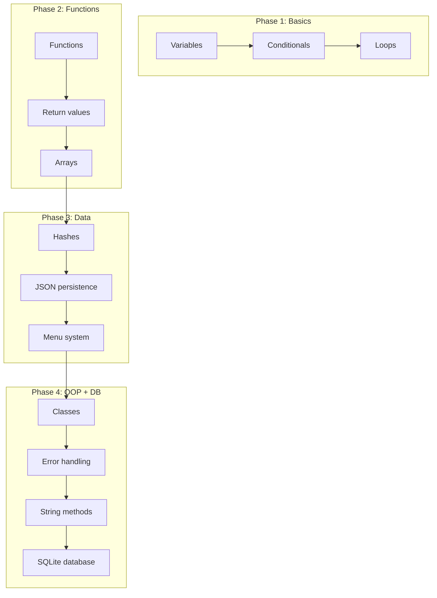
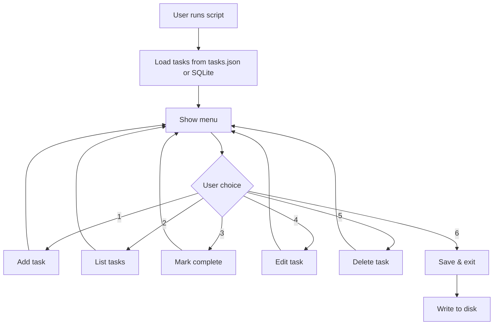

# landonkea-ruby-learning-exercises — Design & Workflow

## High-Level Overview

```mermaid
graph TB
    subgraph "Progressive Learning Path"
        A[01_greet.rb] --> B[02_conditional.rb]
        B --> C[03_loop.rb]
        C --> D[04_list_loop.rb]
        D --> E[05_function.rb]
        E --> F[06_return.rb]
        F --> G[07-add-list-tasks.rb]
        G --> H[08_structured_tasks.rb]
        H --> I[09_mark_complete.rb]
        I --> J[10_save_tasks.rb]
        J --> K[11_load_and_menu.rb]
        K --> L[12_edit_and_delete.rb]
        L --> M[13_classes.rb]
        M --> N[14_error_handling.rb]
        N --> O[15_string_methods.rb]
        O --> P[16_database.rb]
    end
```

## Task Manager Evolution

## Final App Workflow

## File Relationships

| File | Purpose | Concepts Taught |
|------|---------|-----------------|
| `01_greet.rb` | Hello world | Variables, puts |
| `02_conditional.rb` | If/else | Conditionals |
| `03_loop.rb` | Loops | Loops |
| `04_list_loop.rb` | Array iteration | Arrays |
| `05_function.rb` | Methods | Methods |
| `06_return.rb` | Return values | Return |
| `07-add-list-tasks.rb` | Add to array | Array mutation |
| `08_structured_tasks.rb` | Hash tasks | Hashes |
| `09_mark_complete.rb` | Toggle complete | State |
| `10_save_tasks.rb` | JSON save | File I/O |
| `11_load_and_menu.rb` | Load + menu | Menu loop |
| `12_edit_and_delete.rb` | Full CRUD | Complete app |
| `13_classes.rb` | OOP | Classes |
| `14_error_handling.rb` | Begin/rescue | Error handling |
| `15_string_methods.rb` | String ops | String methods |
| `16_database.rb` | SQLite | Database |

## draw.io

[Open in draw.io](https://app.diagrams.net/#RLearning%20path%20progression)
